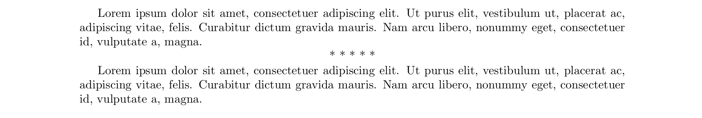

# ornamental-break-asterisks package

Creates macros to show separator rules

## Install package
Put the ornamental-break-asterisks.sty file in any of these locations

* Put the `ornamental-break-asterisks.sty` file in the same path of main tex file, or.
* Execute the commmand:

		kpsewhich -var-value=TEXMFHOME

    and this returns the path of local tex files. By example, if returns 

		/home/username/texmf

    then, put the `ornamental-break-asterisks.sty` file in the directory.

		/home/username/texmf/tex/latex/ornamental-break-asterisks/ornamental-break-asterisks.sty

## Load the package

To load the package use the next command in the preamble of main tex document.

	\usepackage{ornamental-break-asterisks}

